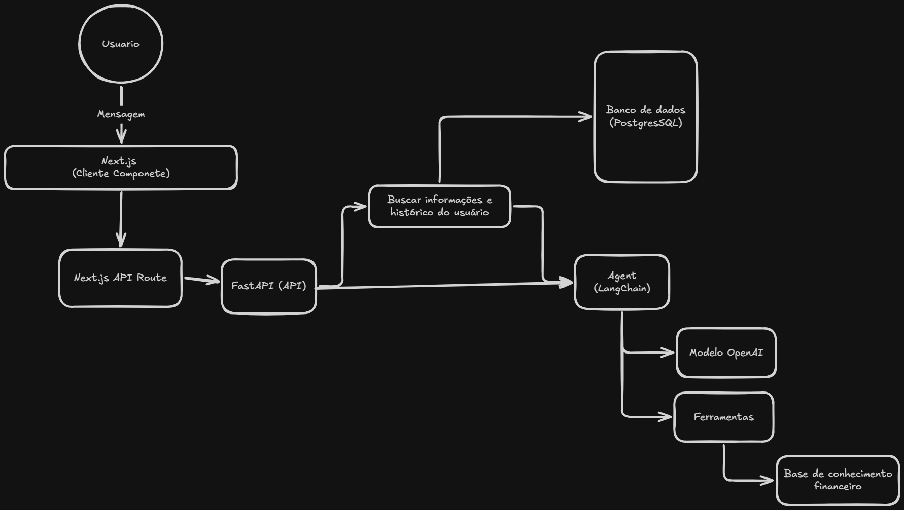

# Finch — Agente Educacional de Investimentos

Finch é um agente de IA para educação financeira voltado a investidores iniciantes. Ele explica conceitos de investimentos, risco, retorno, liquidez e diversificação em uma linguagem simples, objetiva e acessível.

> **Aviso:** Finch possui finalidade educacional. Ele não recomenda compra ou venda de investimentos, não promete rentabilidade e não substitui um profissional certificado.

## Status

🚧 Em planejamento e desenvolvimento do MVP.

## O que o MVP faz

- Criação de perfil educacional do usuário;
- Chat para dúvidas sobre finanças pessoais e investimentos;
- Explicações contextualizadas sobre risco, retorno, liquidez e diversificação;
- Histórico básico de conversas.

## Arquitetura



```text
Next.js → FastAPI → Agente Finch → Modelo OpenAI
                    ↓
                PostgreSQL
```

## Tecnologias previstas

- Next.js e TypeScript;
- Python e FastAPI;
- LangChain;
- OpenAI API;
- PostgreSQL.

## Documentação

A especificação do MVP, o fluxo, a arquitetura, a segurança e as limitações estão em:

- [Documentação do agente](docs/01-documentacao-agent.md)

## Como executar

O projeto ainda está na fase de planejamento do MVP. As instruções de instalação e execução serão adicionadas após a criação da estrutura inicial.
